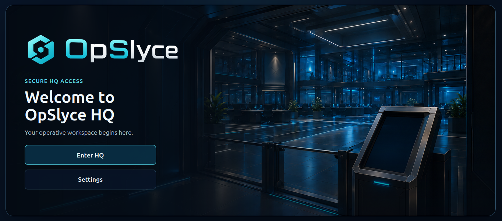
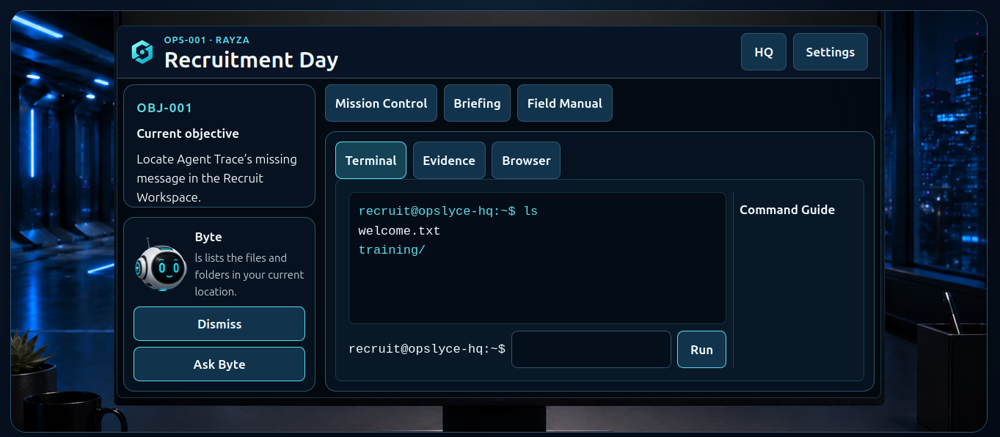

# OpSlyce

**OpSlyce** is a safe, tablet-first cyber adventure for children aged roughly 8–12.

Players become authorised OpSlyce operatives and investigate fictional incidents using a simulated Terminal, simulated Browser and Evidence Locker. The game introduces authentic cyber concepts and real command names while keeping every system safely contained inside an authored fictional environment.

**[Play the live demo](https://opslyce.rayza-slyce.workers.dev)**

Best experienced on a landscape tablet or larger display.




## Playable demo

The current build contains one complete operation:

**OPS-001 — Recruitment Day**

Players investigate a missing message, recover evidence, explore the fictional OpSlyce HQ intranet, verify a recovered flag and complete their first authorised cyber operation.

The demo includes:

- simulated Terminal and virtual filesystem
- simulated internal Browser
- Evidence Locker
- Terminal commands in the current demo: `help`, `ls`, `cd`, `cat` and `clear`
- staged **Ask Byte** guidance
- local save, reload and resume
- restartable operation progress
- touch-first controls with keyboard support
- original procedural sound effects and HQ ambience
- installable PWA support
- offline save/resume support



## Safety by design

OpSlyce does not provide access to a real shell, host filesystem or live cyber target.

Player input is handled entirely inside bounded simulations:

- Terminal commands operate only on an authored virtual filesystem.
- Browser navigation resolves only fictional local routes.
- Flag verification is performed locally.
- No player-entered command or route is sent to a real target.

The missions explicitly establish authorisation and defensive purpose.

## Supported screens

The current demo is designed for **landscape tablets and larger displays**.

Phone support has been explored but is not currently part of the supported demo layout.

## Technology

OpSlyce is built with:

- React
- TypeScript
- Vite
- CSS Modules
- Vitest and React Testing Library
- Playwright
- Workbox / `vite-plugin-pwa`

The current demo is a static web application and requires no backend or account system.

## Run locally

Requirements:

- Node.js 24.x
- pnpm 11.x

Install dependencies:

```text
corepack enable
corepack prepare pnpm@11.13.1 --activate
pnpm install --frozen-lockfile
```

Start development:

```text
pnpm dev
```

Build the production version:

```text
pnpm build
```

Run all automated checks:

```text
pnpm check
```

## Project structure

```text
public/        Runtime images and PWA assets
src/           Application, engine, missions and simulations
tests/         Browser and security acceptance tests
tools/         Repository guard tooling
```

## Current status

OPS-001 is a playable demo candidate.

Core gameplay, persistence, procedural audio and automated offline PWA acceptance are implemented. Hosted-device acceptance and wider playtesting are the next steps.

## Licence

This repository is publicly viewable, but no open-source licence has been granted.

Unless explicitly stated otherwise, the source code and included assets remain all rights reserved.
